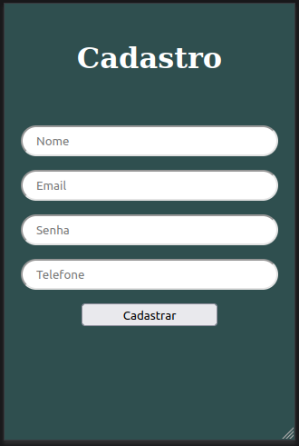

# Tela de cadastro

### Descrição:
Este é um projeto frontend desenvolvido com HTML, CSS e JavaScript, criado com o objetivo de fornecer uma interface amigável e responsiva para o cadastro de usuários. Através dessa tela, os usuários podem inserir suas informações pessoais e salvar os dados em um servidor por meio de uma conexão com uma API REST.

### Recursos e Funcionalidades:
- Interface de usuário intuitiva para inserção de informações de cadastro, como nome, e-mail, senha, etc.

### Tecnologias utilizadas:
<code></code>
<code></code>
<code></code>
<code></code>

- HTML: para estruturar a página e definir os elementos.
- CSS: para estilizar a página e torná-la visualmente atraente.
- JavaScript: para criar interatividade, como a validação dos campos de entrada e o envio dos dados para a API REST.
- Git: para versionamento do código e controle de alterações ao longo do desenvolvimento do projeto.

### Requisitos de Instalação:
1. Clone este repositório em sua máquina local.
2. Abra o arquivo `index.html` em seu navegador web para acessar a Tela de Cadastro de Usuários.

### Contribuição:
Se você deseja contribuir para este projeto, sinta-se à vontade para fazer fork deste repositório, realizar melhorias ou correções e enviar um pull request. Toda contribuição é bem-vinda!

[Clique aqui para acessar](https://jonathandscoutinho.github.io/cadastro_app_frontend/)

### Contato:

 
 
  
    
  

